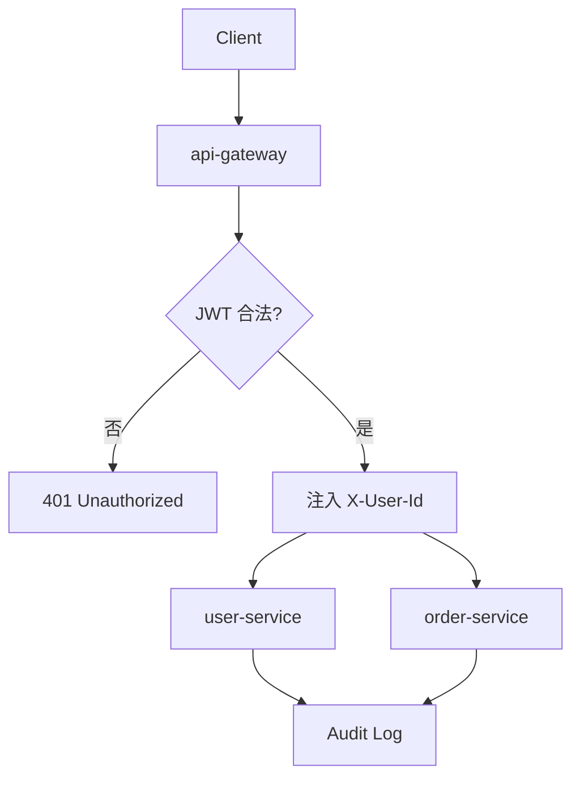
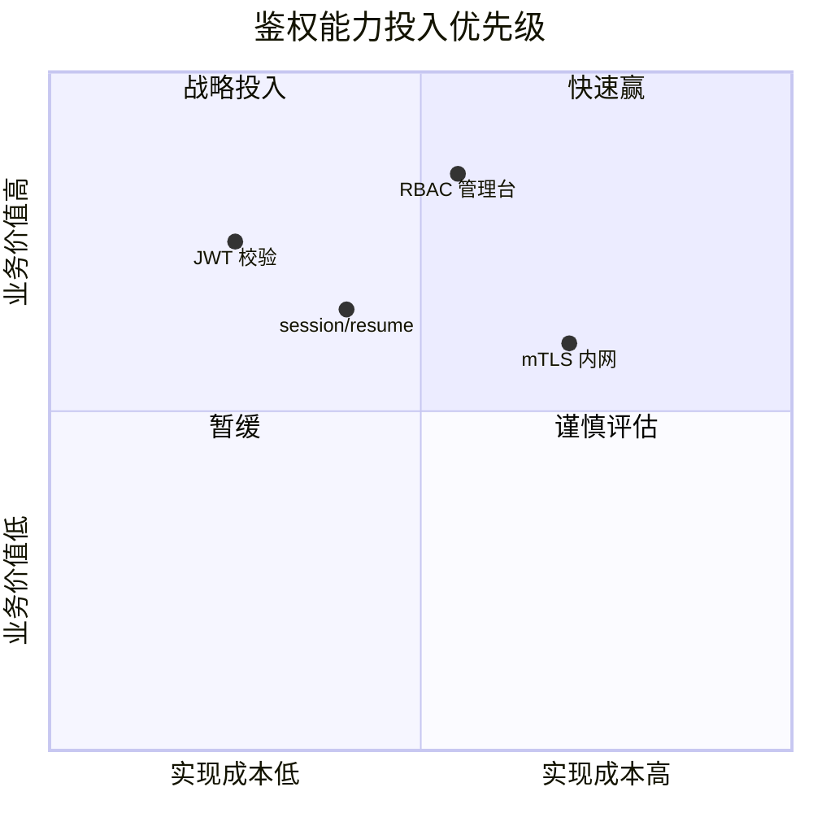

# 架构评审：微服务拆分与统一鉴权方案

**评审范围**：用户域 `user-service`、订单域 `order-service`、网关 `api-gateway` 的边界划分与 OAuth 2.0 / RBAC / JWT 落地。  
_结论草案_：优先 **BFF + 领域服务** 拆分，鉴权走 **Gateway 校验 + 下游信任内网身份头**；~~全链路在每个服务重复验签~~ 改为集中验签。

---

## 1. 背景与目标

当前单体部署在 `C:\Users\bar\deploy\monolith.exe` 的配置目录旁，日志落在 `C:\Users\bar\logs\app.log`。目标是将 **写模型** 与 **读模型** 分离，并在 `/etc/gateway/env` 与 `C:\ProgramData\Gateway\secrets.json` 双环境保持密钥轮换一致。
| 维度 | 现状 | 目标 |
|------|------|------|
| 部署单元 | 1 个 WAR | 5–8 个容器 |
| 鉴权 | Session 粘滞 | JWT + RBAC |
| 观测 | 单机日志 | TraceId 贯穿 |

> 评审前提：内网 mTLS 已启用，公网仅暴露 `api-gateway`。

### 1.1 非功能指标

- **可用性**：核心路径 SLA ≥ 99.9%
- **延迟**：P99 < 200ms（不含冷启动）
  - 网关：&lt; 30ms
  - 领域服务：&lt; 120ms
- **安全**：密钥不落盘到 `C:\Users\bar\baz.py` 这类业务仓库路径

---

## 2. 微服务拆分策略

### 2.1 边界原则（DDD）

按 **聚合根** 切分，避免跨库分布式事务；跨域用 **Outbox + 消息** 保证最终一致。

1. 识别限界上下文
   1. 用户 / 账户
   2. 订单 / 支付编排
2. 定义 API 契约
   - OpenAPI 版本化
   - 向后兼容两个 minor
3. 数据归属
   - 每服务独立 schema
   - 禁止共享表直写

> [!NOTE]
> 若两个团队频繁改同一张表，优先 **合并上下文** 再谈拆分，而不是强行上 Kafka。

### 2.2 服务清单

| 服务            | 拥有数据         | 对外 API     |
| --------------- | ---------------- | ------------ |
| `user-service`  | `users`, `roles` | `/v1/users`  |
| `order-service` | `orders`         | `/v1/orders` |
| `api-gateway`   | 无状态           | `/v1/*`      |

网关路由配置参考（bash）：

```bash
export JWT_ISSUER="https://auth.example.com"
export UPSTREAM_USER="http://user-service:8080"
curl -sS -H "Authorization: Bearer $TOKEN" "$UPSTREAM_USER/v1/me"
```

---

## 3. 鉴权方案对比

### 3.1 Session vs JWT

| 方案         | 优点               | 缺点                 |
| ------------ | ------------------ | -------------------- |
| Session      | 易吊销、服务端控权 | 粘滞会话、Redis 成本 |
| JWT          | 无状态、易水平扩展 | 吊销难、体积大       |
| OAuth 授权码 | 标准、适合第三方   | 实现复杂度高         |

**推荐组合**：公网 OAuth 换 Token；内网 JWT + RBAC Claims；敏感操作仍查 **权限快照**（非 ~~仅信 Claim~~）。

### 3.2 请求链路（flowchart）



### 3.3 优先级矩阵（quadrantChart）



---

## 4. 参考实现片段

网关验签（TypeScript）：

```typescript
import { verify } from 'jsonwebtoken';
export function assertJwt(token: string, issuer: string): Claims {
  return verify(token, process.env.JWKS_PEM!, { issuer, algorithms: ['RS256'] }) as Claims;
}
```

领域侧权限装饰器（Python）：

```python
def require_role(role: str):
    def wrap(fn):
        def inner(ctx, *a, **kw):
            if role not in ctx.roles:
                raise Forbidden()
            return fn(ctx, *a, **kw)
        return inner
    return wrap
```

既有模块中令牌刷新逻辑（带行号引用，示意）：

```296:301:src/auth.py
def refresh_tokens(refresh_token: str) -> TokenPair:
    claims = decode(refresh_token, verify_exp=True)
    if claims["typ"] != "refresh":
        raise AuthError("invalid token type")
    return issue_pair(sub=claims["sub"], scopes=claims["scopes"])
```

---

## 5. 风险与决策记录

- _风险_：JWT 泄漏后窗口期内无法即时失效 → 缩短 `access_token` TTL + 刷新轮换
- **风险**：跨服务循环依赖 → 引入 **防腐层** ACL
- ~~风险：每个服务直连 MySQL 主库~~ → 已否决，改 CQRS 读库
  > “先保证 **身份传播契约** 稳定，再扩服务数量。” — 架构组 2026-Q2 纪要
  > 块公式（容量粗算）：稳态 QPS 与实例数关系可用  
  > $$ \text{instances} \geq \frac{\lambda \cdot RT}{CPU\_{\text{util}}} $$
行内近似：能耗类比 $E = mc^2$ 仅作 _数量级直觉_，**不可**用于容量公式。

### 5.1 行动项

1. 两周内完成网关 JWT 验签与 RBAC Claim 映射
2. 一月内完成 `user-service` 数据迁移
   - 双写一周
   - 灰度 10% → 50% → 100%
3. 文档与 Runbook 同步到内部 Wiki：[架构评审模板](https://wiki.example.com/arch/review-template)
   更多标准见 OAuth 2.0 规范：https://datatracker.ietf.org/doc/html/rfc6749

---

## 6. 附录：路径与配置约定

- Unix：`/etc/foo/jwt.yaml`、`/var/log/gateway/access.log`
- Windows：`C:\Users\bar\baz.py` 仅本地调试；生产用 `C:\ProgramData\Gateway\`
- 环境变量：`JWT_AUDIENCE`、`OTEL_EXPORTER_OTLP_ENDPOINT`
  **签署**：架构负责人 \***\*\_\_\*\***　安全负责人 \***\*\_\_\*\***　日期 2026-05-29
